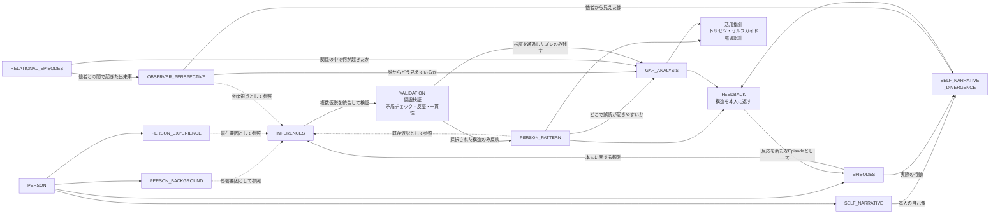

# モジュールコンセプト

## なぜこのモジュールがあるか

誰にでも、自分を曝け出せる場所がある。
銀座のママの前で鎧を脱ぐように、誰かの前では本音が出る。弱さも、欲も、恐れも。

でも、曝け出したものはその場で消える。
語った言葉は空気に溶け、気づきはいつの間にか忘れる。
自分の輪郭が一瞬見えても、日常に戻れば元のぼんやりした自己像に戻る。

このモジュールは、その「曝け出されたもの」を外に出して、形にして、育てるためにある。

やりたいことは3つ。

1. **曝け出す場を作る** — 鎧を脱いでも安全な空間をつくり、その人の中にあるものを自然に引き出す
2. **外部化する** — 引き出された構造を、本人が見える形に残す。消えないようにする
3. **育てて発揮させる** — 外部化された構造を更新し続け、その人の特徴が人生で活きる形にする

その人の中にあるものを、外に出して、育てて、活かす。自分のトリセツを自分で育てるための仕組みである。

## このモデルが扱うもの

本人に関する観測事実を `Episodes` として蓄積し、他者視点を `Observer_Perspective` として集め、そこから生まれる解釈を `Inferences` として分離し、検証を通過したものだけを `Person_Pattern` と `Gap_Analysis` として残す。

扱うのは人格の断定ではなく、その人の欲望・防衛・文脈ごとの振る舞い・認知ギャップを、反証可能な仮説として更新し続ける構造である。

## 設計原則

### 1. 曝け出せる場を壊さない

分析の精度より、安全な空間の維持が先。
本人が鎧を脱いで話せる状態を作ることが、すべてのデータの質を決める。

聞き手が構造を見つけようと前のめりになった瞬間、場は壊れる。
質問はメスではなく鏡として機能させる。

### 2. 外部化は本人のためにある

このモデルが作る構造は、分析者の知的成果物ではない。
本人が自分を理解し、自分の特徴を活かすための道具である。
本人の同意なく他者に渡さない。本人の人生で使えて初めて意味がある。

### 3. 表面を信じるな、観測しろ

分類より先に観測を置く。自己申告より、繰り返す行動と圧力下の反応を重視する。
発言や自己イメージは矛盾しやすい。繰り返す行動、圧がかかった時の反応、何に怒るか——これらは矛盾しにくい。

事実（`Episodes`）と解釈（`Inferences`）は常に分離する。この分離を崩すと、モデル全体が恣意的になる。

### 4. 認知ギャップは他者視点を取らないと見えない

本人の自己理解だけでは、「どう見えているか」は分からない。
認知ギャップは、本人の意図・実際の行動・他者の受け取りのズレとして生まれる。

### 5. すべては暫定であり、更新される

`Person_Background` も `Person_Experience` も `Person_Pattern` も、確定した結論ではない。
エピソードの積み重ねから推定される仮説であり、新しい観測や反証によって更新・修正・破棄される。

## 各要素の定義

### Person_Background

比較的変わりにくい、生得的な反応基盤に関する仮説を保持する。  
ここでは出生や家庭構成のようなプロフィール情報ではなく、その人の OS に近い前提を扱う。

重要なのは、`Person_Background` も多くの場合は直接取得される事実ではなく、エピソードの積み重ねから推定される安定仮説だということ。

含むものの例:

- `extroversion_introversion`: 人との接触や刺激でエネルギーがどう動くか
- `abstract_concrete`: 構造で掴みやすいか、手触りで掴みやすいか
- `risk_appetite`: 変化や不確実さにどう反応しやすいか
- `emotional_reactivity`: 出来事にどれくらい強く反応しやすいか
- `communication_style`: 情報をどう処理し、どう伝え、どう受け取るか
- `energy_management`: エネルギーのリズム、充電方法、消耗パターン、限界のサイン
- `learning_style`: 未知のものをどう掴み、どう身につけるか

役割:

- 行動や解釈の土台となる「反応の癖」を保持する
- 同じ出来事でも反応が分かれる前提差を説明する
- その人とどうコミュニケーションすればいいかを説明する
- その人をどう扱えば壊さないかを説明する

### Person_Experience

後天的に形成された欲望、欠乏、防衛、自己物語を保持する。  
単なる出来事ログではなく、その人の期待形成や報酬系、防衛線に影響する重要な形成済み構造を扱う。

`Person_Experience` もまた、本人の自己申告だけで確定するものではない。  
重要な過去エピソードや現在の反応パターンから、繰り返し推定される構造として扱う。

`Person_Experience` は特に以下の層を内包する。

- `Aspiration & Drives`: 何がその人のガソリンになるか
- `Guardrails`: 何を死や崩壊として恐れ、何を守るために切り捨てるか

含むものの例:

- `drives`: 何を報酬として感じやすく、何を埋めようとして動くか
- `self_narrative`: 自分をどういう人間だと見ているか
- `guardrails`: 何を危険だと感じ、何を守るためにどんな逃げ方をしやすいか
- `trust_structure`: 何をきっかけに信頼し、何で壊れ、回復するか
- `attrition_pattern`: 何に飽き、何で離脱し、何が異常に続くか
- `value_tradeoff`: 大事なもの同士がぶつかった時に何を守り、何を切るか

役割:

- 何がガソリンになるか
- 何が防衛線になるか
- どの文脈で防御や過剰適応が出やすいか
- 何がガス欠を起こすか
- この人との関係をどう築き、どう壊さないか

を推測するための補助変数になる。

### Episodes

日々の出来事・行動・コンテキストを含む可変データ。  
アプリケーションごとに柔軟に定義され、継続的に蓄積される。

`Episodes` は特に以下の層の観測証拠になる。

- `Behavioral Patterns`: 日常的に繰り返される出力
- `Contextual Shift`: 誰と、どこで、どう変わるか
- `Under Pressure`: 圧がかかった時に何が出るか

最低限含みたい項目:

- `what_happened`: 何が起きたか
- `who_was_there`: 相手は誰だったか
- `power_gradient`: 権力差はあったか
- `public_private`: 公の場か、私的な場か
- `normal_or_pressure`: 平時か、緊急時か
- `observed_action`: 何をしたか、しなかったか
- `felt_state`: その時どう感じたか
- `outcome`: 結果として何が起きたか
- `recovery`: その後どう回復したか
- `self_interpretation`: 後から見ると、何を守ろうとしていたと思うか

拡張フィールド（該当する Episode にのみ付与する）:

- `認知ギャップ構造`: 本人と相手がどの次元（価値観/抽象度/前提/視点の高さ）で処理していたか
- `対比構造`: approach_drive（獲得欲）と avoidance_drive（損失回避）の分離。どちらが行動を決めたか
- `意思決定の軸`: 判断を歪めている制約、制約がなければどう判断したかったか

すべてを毎回埋める必要はない。会話の流れで自然に出たものだけ記録する。

アプリケーション層で追加されうる項目の例（`field-definitions.md` に詳細）:

- `execution_pattern`, `contextual_shift`, `pressure_response`
- 経営者向け: `authority_expression`, `delegation_gap`, `presence_cost`, `symbolic_load`

役割:

- モデルにおける最小の観測単位
- 解釈の出発点
- `Behavioral Patterns` `Contextual Shift` `Under Pressure` を推定するための観測証拠

### Inferences

Episode 単位で生成される意味づけ。  
`Background` `Experience` `Pattern` の影響を受けうるが、それ自体は仮説である。

他者ヒアリングがある場合、`Observer_Perspective` も `Inferences` の参照材料になる。  
ただし、他者視点は `Inference` に吸収して消すのではなく、独立したデータとして残す。

例:

- この場面では評価恐怖が強く出た可能性がある
- この人は権力差でモードが切り替わる可能性がある
- この行動は主体性というより欠乏駆動かもしれない
- この失敗反応は Defensive Mode であり、責任回避が優先された可能性がある

役割:

- 観測事実を構造仮説に変換する
- 複数 Episode を横断した検証の材料になる

### Validation

複数の `Inferences` を統合し、矛盾・一貫性・再現性を検証するプロセス。

Validation が見るもの:

- 同じ仮説が複数文脈で繰り返し現れているか
- 別解釈の方が説明力が高くないか
- 背景や既存パターンによる解釈バイアスが入りすぎていないか
- 圧力下、平時、内外集団など複数条件で観測が整合しているか

役割:

- 仮説を採択、保留、棄却する
- 一貫しない解釈をそのまま Pattern に昇格させない
- 他者視点が関わる場合は、本人の構造と他者から見えた像のズレが再現するかも確認する

### Person_Pattern

Validation を通過した構造のみが残ったもの。  
固定ラベルではなく、更新され続ける動的な理解。

Pattern が持つべきもの:

- どんな OS 的傾向を持つ可能性が高いか
- 何が報酬として機能しやすいか
- 何が Guardrail になりやすいか
- 日常でどういう出力傾向を繰り返すか
- どの文脈でモードが切り替わるか
- 圧力下でどういう Survival Strategy を取りやすいか
- どういう環境で能力が発揮されやすいか
- どう伝えれば届くか、どう扱えば壊さないか

### Observer_Perspective

ある観測者から見た、対象者の像を保持する。

これは対象者の真実そのものではなく、  
「誰からどう見えているか」を保持するためのデータである。

役割:

- 他者ヒアリングの結果を独立して残す
- `Person_Pattern` と他者視点のズレを比較できるようにする
- `Gap_Analysis` の材料にする

### Gap_Analysis

`Person_Pattern`、`Observer_Perspective`、`Relational_Episodes` のズレを統合し、
最終的に「どこに認知ギャップがあるか」を保持する。

認知ギャップとは、単なる誤解ではなく、**同じ事象に対して異なる次元で解釈している状態**。
ズレが生まれる次元は4つある。

- **価値観**: 何を大事にしているかが違う
- **抽象度**: どの粒度で処理しているかが違う
- **前提**: 当たり前にしている暗黙知が共有されていない
- **視点の高さ**: 見ている時間軸・スコープが違う

具体的なパターンは `gap-analysis.md` に定義。

役割:

- 本人の意図と他者の受け取りのズレを、4次元で構造化して保持する
- どの次元でズレが起きているかを特定する
- 修復や改善の起点をつくる

### Self_Narrative_Divergence

`Self Narrative`（本人が語る自己像）と `Episodes`（本人の実際の行動）の乖離を検出・保持する構造。

Gap_Analysis が **本人 vs 他者** のズレを扱うのに対し、
Self_Narrative_Divergence は **本人が言ってること vs 本人がやってること** のズレを扱う。

「お前違ってるよ」と言えるための根拠はここに蓄積される。

ブラインドスポットの類型:

- **過大評価**: 自分はできていると思っているが、Episodes が裏付けない（例: 「人を大事にしてる」が、Episodesでは効率優先で人を切っている）
- **過小評価**: 自分にはないと思っているが、他者や Episodes から見えている（例: 「リーダーシップがない」が、周囲は頼りにしている）
- **誤帰属**: 行動の理由が本人の認識と違う（例: 「論理で決めてる」が、実は感情で決めている）
- **死角**: そもそもその領域を認識していない（例: 自分の沈黙が周囲に与える影響に気づいていない）

検出の仕方:

- Self Narrative の主張と、Episodes の行動事実を突き合わせる
- 同じテーマで複数 Episodes を並べて、Self Narrative との一貫性を見る
- Observer_Perspective が Self Narrative と矛盾する場合、どちらが Episodes と整合するかで判定する
- 1つの乖離では確定しない。複数文脈で再現するかを Validation で確認する

### フィードバック設計

集めた構造を本人に返すフェーズの設計。

「お前違ってるよ」は、正しいタイミングで、正しい順序で、正しい根拠とともに伝えなければ、防衛を固めるだけで終わる。

#### いつ伝えるか

- 十分な Episodes が揃い、Validation を通過した後
- 信頼関係が構築された後（基盤ヒアリング完了後）
- 本人が「聞く準備ができている」状態の時

#### どう伝えるか

- 結論から入らない。Episodes を並べて、本人に気づかせる
- 「あなたはこう言っていました。でもこの場面ではこうでした」とエピソードで返す
- 聞き手の解釈ではなく、事実の並置で矛盾を浮かせる
- 本人の反応も新しい Episode として取る

#### どの順番で伝えるか

1. **過小評価から入る**: 本人が気づいていない強みを先に伝える。防衛が下がる
2. **誤帰属を返す**: 「理由が違うかもしれない」は受け入れやすい
3. **過大評価を返す**: 最も防衛が上がるので最後。エピソードの証拠を十分に積んでから
4. **死角は直接言わない**: エピソードを並べて、本人の中で浮かび上がるのを待つ

#### 伝えた後どうするか

- 本人の反応を観察し、Episode として記録する
- 反発、沈黙、驚き、涙——すべてが追加の材料になる
- 受け入れられなかった場合、無理に押さない。時間を置いて再検証する
- 受け入れた場合、その気づきが行動に反映されるかを後続 Episodes で追う

### 活用設計（発揮させる）

外部化された構造を「知って終わり」にしない。その人の特徴が人生で実際に活きる形にするフェーズ。

ここが「育てる」の本体。分析の精度を上げることが目的ではなく、本人がその構造を使って動けるようになることが目的。

#### Person_Pattern から導出する活用指針

| 構造 | 活用の問い |
|------|----------|
| Drives | この人のエンジンがかかる条件は何か。どういう仕事・役割・環境を選べばガソリンが自然に供給されるか |
| Guardrails | この人が壊れる条件は何か。どういう状況を避け、どういうセーフティネットを用意すべきか |
| best_environment | どの環境条件で最も自然に力が出るか。裁量、刺激、人数、管理の強さの最適値は何か |
| communication_style | この人にはどう伝えれば届くか。どう聞けば本音が出るか |
| energy_management | どうすれば消耗せずに持続的に出力できるか。何を減らし、何を増やすか |
| contextual_shift | どの文脈でモードが切り替わるか。最もパフォーマンスが出るモードにどう入れるか |
| pressure_response | 有事にどう反応するか。その反応を前提にした危機対応の設計は何か |
| attrition_pattern | 何がガス欠を起こすか。長期で続けるために何が必要か |
| value_tradeoff | 判断に迷った時、何を基準にすればその人らしい選択ができるか |

#### Gap_Analysis から導出する活用指針

| 構造 | 活用の問い |
|------|----------|
| 認知ギャップ | どこで誤読されやすいかを本人が知っていれば、先に言語化できる。「率直に言うけど、攻撃じゃないからね」が自然に出る |
| Self_Narrative_Divergence | 自分の思い込みと実際のズレを知っていれば、判断の歪みに気づける |

#### 活用の形式

- **トリセツとして**: 「この人と仕事するならこう付き合え」を他者に渡せる形にする
- **セルフガイドとして**: 「自分がこういう状態の時はこうしろ」を本人が持てる形にする
- **環境設計として**: 「この人にはこういう環境を用意しろ」を組織に提案できる形にする
- **判断基準として**: 「迷った時にこれを見ろ」を本人の意思決定の道具にする

## 標準フロー

ヒアリングの詳細設計は `hearing-design.md` に定義する。

### 初回サイクル（外部化する）

1. 基盤ヒアリングで `Person_Background` と `Person_Experience` の仮説候補を作る
2. 人に関する出来事や行動を `Episodes` として記録する
3. 他者ヒアリングがある場合は、関係の中で起きた出来事を `Relational_Episodes` として記録し、`Observer_Perspective` を残す
4. 各 Episode に対して、複数の `Inferences` を生成する
5. `Background` `Experience` `Pattern` を補助変数として参照しつつも、証拠とは分けて扱う
6. 複数の Inference を `Validation` で統合し、矛盾・反証・一貫性を確認する
7. 検証を通過した構造だけを `Person_Pattern` に反映する
8. `Person_Pattern` と `Observer_Perspective` と `Relational_Episodes` のズレを `Gap_Analysis` にまとめる
9. `Self Narrative` と `Episodes` の乖離を `Self_Narrative_Divergence` として検出する
10. `Person_Pattern` と `Gap_Analysis` から活用指針を導出する

### フィードバック（伝える）

11. フィードバックセッションで構造を本人に返し、反応を新たな Episode として取る
12. 活用指針（トリセツ、セルフガイド、環境設計）を本人に渡す

### 育成サイクル（育てて発揮させる）

初回サイクルで終わりではない。外部化された構造は、使い続けることで育つ。

13. 新しい Episodes が蓄積される（日常の行動、新しい文脈、環境変化）
14. 既存の Person_Pattern と Gap_Analysis を新しい Episodes で再検証する
15. 変化があれば Pattern を更新し、活用指針も更新する
16. 本人が活用指針を使った結果を Episode として取る（使えたか、使えなかったか、何が違ったか）
17. フィードバックを再度行い、構造の精度と活用度を上げる

このサイクルを回すことで、トリセツは「もらったもの」から「自分で育てるもの」になる。

育成サイクルのトリガー:
- 新しい環境に入った（転職、新事業、新しい関係）
- 大きな判断をした（事業撤退、人事、投資）
- 壊れた・壊れかけた（燃え尽き、関係破綻、判断ミス）
- 本人が「前と違う気がする」と感じた

## 図

## 一言で定義すると

> 曝け出されたものを外に出し、形にし、育て、その人の特徴が人生で活きるようにするためのモデル
