# モジュールコンセプト

## なぜこのモジュールがあるか

その人の中にあるものを、外に出して、育てて、活かす。自分のトリセツを自分で育てるための仕組みである。

## このモデルが扱うもの

本人に関する観測事実を `Episodes` として蓄積し（他者が本人について語った Episode も含む）、そこから生まれる解釈を `Inferences` として分離し、検証を通過したものだけを `Person_Pattern` と `Cognitive_Divergence` として残す。

扱うのは人格の断定ではなく、その人の欲望・防衛・文脈ごとの振る舞い・認知ギャップを、反証可能な仮説として更新し続ける構造である。

## 設計原則

### 1. 曝け出せる場を設計する

鎧を脱いでも安全な空間をつくり、その人の中にあるものを自然に引き出す。聞き手が構造を見つけようと前のめりになってはいけない。

### 2. 複雑性をそのまま受け入れる

人は複雑な存在であり、MBTIのように人を類型することや、シンプルな言語化でその人を反映することは不可能である。よって言語化することによって生まれる矛盾をむしろ称賛する。

その人の中にあるものは、言語化された瞬間に丸められる。
本人が正直に、誠実に語っていても、言葉にした時点で近似値になる。
特に言語化が上手い人ほど「きれいに整った近似値」を出す。
それを額面通り受け取ると、本人の構造ではなく本人の言語能力の構造を記録することになる。

聞き手は、出てきた言葉を「入口」として扱い、その奥にあるものを場面・身体・矛盾・沈黙から取りに行く。

事実（`Episodes`）と解釈（`Inferences`）は常に分離する。この分離を崩すと、モデル全体が恣意的になる。

### 3. 外部化して育てる

引き出された構造を、本人が見える形に残す。外部化された構造を更新し続け、その人の特徴が人生で活きる形にする

### 4. 認知ギャップは他者視点を取らないと見えない

本人の自己理解だけでは、「どう見えているか」は分からない。
認知ギャップは、本人の意図・実際の行動・他者の受け取りのズレとして生まれる。

### 5. すべては暫定であり、更新される

`Person_Background` も `Person_Experience` も `Person_Pattern` も、確定した結論ではない。
エピソードの積み重ねから推定される仮説であり、新しい観測や反証によって更新・修正・破棄される。

また1回のセッションで取れるものには限界がある。
同じ構造が時間を置いて別の文脈から出てくるかどうかが、「それっぽさ」と「本当」を分ける手段になる。

### 6. 変わって欲しいものと、変わって欲しくないものを提示する

その人のコアで良いところと、後天的にそう思っただけで、そこに固執してんじゃねえよみたいなところを分けて頭をぶん殴るような体験をさせる。本当に大切にすべきものがわかったり、する。一回短期的には自己嫌悪になってほしいが、5年後には言われて良かったと感じてもらうような、愛のあるメッセージを届けたい。


## 各要素の定義

### Person_Background

比較的変わりにくい、生得的な反応基盤に関する仮説を保持する。
ここでは出生や家庭構成のようなプロフィール情報ではなく、その人の OS に近い前提を扱う。

重要なのは、`Person_Background` も多くの場合は直接取得される事実ではなく、エピソードの積み重ねから推定される安定仮説だということ。

含むものの例:

- `extroversion_introversion`: 人との接触や刺激でエネルギーがどう動くか
- `abstract_concrete`: 構造で掴みやすいか、手触りで掴みやすいか
- `risk_appetite`: 変化や不確実さにどう反応しやすいか
- `emotional_reactivity`: 出来事にどれくらい強く反応しやすいか
- `communication_style`: 情報をどう処理し、どう伝え、どう受け取るか
- `energy_management`: エネルギーのリズム、充電方法、消耗パターン、限界のサイン
- `learning_style`: 未知のものをどう掴み、どう身につけるか

役割:

- 行動や解釈の土台となる「反応の癖」を保持する
- 同じ出来事でも反応が分かれる前提差を説明する
- その人とどうコミュニケーションすればいいかを説明する
- その人をどう扱えば壊さないかを説明する

### Person_Experience

後天的に形成された欲望、欠乏、防衛、自己物語を保持する。
単なる出来事ログではなく、その人の期待形成や報酬系、防衛線に影響する重要な形成済み構造を扱う。

`Person_Experience` もまた、本人の自己申告だけで確定するものではない。
重要な過去エピソードや現在の反応パターンから、繰り返し推定される構造として扱う。

`Person_Experience` は特に以下の層を内包する。

- `Aspiration & Drives`: 何がその人のガソリンになるか
- `Guardrails`: 何を死や崩壊として恐れ、何を守るために切り捨てるか

含むものの例:

- `drives`: 何を報酬として感じやすく、何を埋めようとして動くか
- `self_narrative`: 自分をどういう人間だと見ているか
- `guardrails`: 何を危険だと感じ、何を守るためにどんな逃げ方をしやすいか
- `trust_structure`: 何をきっかけに信頼し、何で壊れ、回復するか
- `attrition_pattern`: 何に飽き、何で離脱し、何が異常に続くか
- `value_tradeoff`: 大事なもの同士がぶつかった時に何を守り、何を切るか

役割:

- 何がガソリンになるか
- 何が防衛線になるか
- どの文脈で防御や過剰適応が出やすいか
- 何がガス欠を起こすか
- この人との関係をどう築き、どう壊さないか

を推測するための補助変数になる。

### Person

モデルにおける「人物」の識別単位。
`Session.participants`、`Episode.speaker`、`Episode.about` など、あらゆるエンティティが人物を参照する。

本キットでは本人インタビューのみを扱うため、対象は本人 1 名。Session の中で言及される他者は `Episode.about` で参照される。

### Session

データ収集の最小単位。1回の会話・インタビュー・ミーティングなど、連続した記録を1つの Session として扱う。

`Session` は人に属さない。参加者全員に等しく属する。
session から抽出された `Episodes` が `data/structured/` に集約される。

形式は本文フォーマット自体で自明になる（Q/A 形式 / 話者タグ形式）。session_type フィールドでの分類は廃止。

**speaker と about の非対称設計:**

- **speaker（誰が発言したか）** は participants 内の推定で十分。誤っても影響は軽微
- **about（誰の話なのか）** は confidence 付きで慎重にタグ付け。誤ると人物像が壊れる

### Episodes

日々の出来事・行動・コンテキストを含む可変データ。
アプリケーションごとに柔軟に定義され、継続的に蓄積される。

`Episodes` は特に以下の層の観測証拠になる。

- `Behavioral Patterns`: 日常的に繰り返される出力
- `Contextual Shift`: 誰と、どこで、どう変わるか
- `Under Pressure`: 圧がかかった時に何が出るか

最低限含みたい項目:

- `what_happened`: 何が起きたか
- `who_was_there`: 相手は誰だったか
- `context`: 場の属性オブジェクト。`power`（権力差）/ `setting`（公・私）/ `pressure`（平時・有事）をまとめて持つ
- `observed_action`: 何をしたか、しなかったか
- `felt_state`: その時どう感じたか
- `outcome`: 結果として何が起きたか
- `recovery`: その後どう回復したか
- `self_interpretation`: 後から見ると、何を守ろうとしていたと思うか

セッション追跡フィールド:

- `session_date`: いつのセッションで取れたか
- `session_number`: 通算何回目のセッションか
- `is_revisit`: 過去に触れたテーマの再訪か
- `revisit_of`: どのエピソードの再訪か

拡張フィールド（該当する Episode にのみ付与する）:

- `認知ギャップ構造`: 本人と相手がどの次元（価値観/抽象度/前提/視点の高さ）で処理していたか
- `対比構造`: approach_drive（獲得欲）と avoidance_drive（損失回避）の分離。どちらが行動を決めたか
- `意思決定の軸`: 判断を歪めている制約、制約がなければどう判断したかったか

すべてを毎回埋める必要はない。会話の流れで自然に出たものだけ記録する。

アプリケーション層で追加されうる項目の例（`field-definitions.md` に詳細）:

- `execution_pattern`, `contextual_shift`, `pressure_response`
- 経営者向け: `authority_expression`, `delegation_gap`, `presence_cost`, `symbolic_load`

役割:

- モデルにおける最小の観測単位
- 解釈の出発点
- `Behavioral Patterns` `Contextual Shift` `Under Pressure` を推定するための観測証拠

### Inferences

Episode から生成される意味づけ。
`Background` `Experience` `Pattern` の影響を受けうるが、それ自体は仮説である。

`Inferences` は2つの層を持つ。

**Episode 単位の Inference:**

1つの Episode から生まれる読み。

例:
- この場面では評価恐怖が強く出た可能性がある
- この人は権力差でモードが切り替わる可能性がある
- この行動は主体性というより欠乏駆動かもしれない
- この失敗反応は Defensive Mode であり、責任回避が優先された可能性がある

**セッション横断の Inference:**

複数セッションの突合から生まれる読み。時間差を使った検証の核になる。

例:
- Session 1 では「人を大事にしている」と語ったが、Session 3 では効率優先で人を切ったエピソードが出た。overestimation の可能性がある
- Session 2 と Session 4 で同じ構造が別文脈から出てきた。再現性が高い
- 前回きれいに言語化されていた drives が、有事エピソードでは別の形で現れた。言語化と実際の駆動力にズレがある可能性がある

他者ヒアリングがある場合、他者視点の Episode（`speaker: 他者, about: 本人`）も `Inferences` の参照材料になる。
Inference に `source: observer` を付ければ、どの視点由来の仮説かを追跡できる。

役割:

- 観測事実を構造仮説に変換する
- 複数 Episode を横断した検証の材料になる
- セッション間の変化・一貫性を構造的に捉える

### Validation

複数の `Inferences` を統合し、構造として残すかを判定するプロセス。
Validation は2つのモードを持ち、両方を通過して初めて Pattern / Divergence に昇格する。

#### Reality check（再現性の確認）

そのパターンが本当に存在するかを確認するモード。1回限りの現象や文脈依存の振る舞いを Pattern に上げないための歯止め。

見るもの:

- 同じ仮説が複数文脈で繰り返し現れているか
- 圧力下、平時、内外集団など複数条件で観測が整合しているか
- 複数セッションで時間差をおいて同じ構造が出たか
- セッション間で変化した場合、何がトリガーだったか
- 背景や既存パターンによる解釈バイアスが入りすぎていないか

#### Articulation check（言語化の比較優位）

そのパターンを記述する最適な言語を選ぶモード。Reality check を通過した仮説が、既存の Pattern / Gap / Divergence との関係で**どこに置かれるべきか**を判定する。

新しい仮説が出たとき、以下の手続きを踏む:

1. **同じエピソード群に乗っている既存エントリを列挙する** — Pattern / Cognitive_Divergence / Gap（あれば）のうち、同じ Episode / Inference を根拠にしているもの、または同じ現象領域を扱っているもの
2. **既存言語化 vs 新言語化を比較する** — どちらがエピソード群をより本質的に説明するか、取りこぼしが少ないか、メカニズム（なぜそう振る舞うか）を言えているか
3. **決定を選ぶ** — 以下の4択から選ぶ:
   - `update`: 既存エントリの言語化を書き換える（id は維持）
   - `integrate`: 複数の既存エントリを1つに統合する
   - `replace`: 既存エントリを削除して新しいエントリで置き換える
   - `new`: 既存のどれにも収まらないため新規追加する（**例外的な判断**）
4. **比較と選択の根拠を記録する** — どの既存エントリと比較したか、なぜその選択にしたかを validation 記録に残す

`new` は例外扱い。**既存との比較をせずに並列追加することは原則禁止**。Pattern がリスト化して膨張することを防ぐための制約。

#### 優先順位と前提

Reality check が通らなければ Articulation check に進まない（存在しないものの言語化を比較しても意味がない）。ただし一方で、Reality check の「別解釈の方が説明力が高くないか」の判断は Articulation check の手続きに吸収される（既存 vs 新の比較はそこで行う）。

役割:

- 仮説を採択、保留、棄却する
- Pattern が膨張リスト化するのを防ぐ
- 一貫しない解釈をそのまま Pattern に昇格させない
- 他者視点が関わる場合は、本人の構造と他者から見えた像のズレが再現するかも確認する

### Person_Pattern

Validation を通過した構造のみが残ったもの。
固定ラベルではなく、更新され続ける動的な理解。

Pattern が持つべきもの:

- どんな OS 的傾向を持つ可能性が高いか
- 何が報酬として機能しやすいか
- 何が Guardrail になりやすいか
- 日常でどういう出力傾向を繰り返すか
- どの文脈でモードが切り替わるか
- 圧力下でどういう Survival Strategy を取りやすいか
- どういう環境で能力が発揮されやすいか
- どう伝えれば届くか、どう扱えば壊さないか

#### mutability フィールド（コア vs 固執の分類）

Pattern の**各要素に必ず `mutability` を付与する**。設計原則6「変わって欲しいものと、変わって欲しくないものを提示する」を成果物（殴り書き等）で形式化するための一次データ。

| 値 | 意味 | 典型例 |
|---|---|---|
| `core` | **変わってほしくない**、その人の本質的な反応基盤・強み・生得的な性質 | 生得的な神経系の性質、譲れない価値観、本人の核になっている drives |
| `fixation` | **変わってほしい**（揺らすべき）、後天的に身につけた思い込みや固執、役に立たなくなった自己像や防衛 | 過剰な guardrails、固定化した self_narrative のうち現環境で機能していないもの、`Cognitive_Divergence (narrative_vs_action)` で validated された過大評価 |
| `unclear` | 判断材料が不足 | 新規 Pattern で Validation は通ったが、core / fixation の判定に必要な Episode / 他者視点が足りない |

判定の基準:

- **core の根拠**: 時系列を越えて不変、複数文脈で一貫、本人が外した時に機能不全を起こす、他者視点からも同じ像が返る
- **fixation の根拠**: 形成時の文脈が明確（「○○の時に身につけた」）、現環境では過剰 or 逆効果、本人が違和感を語ることがある、`narrative_vs_action` divergence の根拠になっている
- **unclear の扱い**: 外部化レビューで本人の反応を取って判定材料を増やす。判定が確定するまで殴り書きの §1 §2 には入れない

mutability の使い方:

- PERSON_PATTERN の各要素に `mutability: core | fixation | unclear` を付ける
- 成果物生成時に `mutability: core` は活かす、`mutability: fixation` は手放す対象、として扱う

#### 言語の責任分担

Pattern の言葉は「本人の言葉をそのまま乗せる」ものではない。設計原則2「複雑性をそのまま受け入れる」に従い、本人の言葉は近似値であり、聞き手は場面・身体・矛盾・沈黙から本質を取りに行くという前提を Pattern のレベルでも貫く。

エンティティごとの言語責任:

| レイヤ | 誰の言葉か | 理由 |
|-------|----------|------|
| Episodes | **本人の言葉のまま** | 観測事実。聞き手が言い換えると事実が歪む。Episode は原材料として原文を保持し、再解釈の余地を残す |
| Inferences | **聞き手の言葉** | Episode から生まれる「意味づけ」そのもの。聞き手が分析的に言語化する場。Episode への参照を持つことで検証可能性を担保 |
| Person_Pattern | **最も本質的だと思う言葉**（本人 / 聞き手どちらでも） | Validation を通過した構造記述。入口の言葉より本質的に言い当てられるなら、聞き手が本人を超えた言語化を採用してよい |

Pattern での言語選択ルール:

1. **本人の言葉が本質的なら本人の言葉を使う** — 特に身体感覚・メタファー・本人独自の呼び方は本人の言葉の方が強いことが多い
2. **聞き手の言葉の方が本質的なら聞き手の言葉を使う** — 場面・矛盾・沈黙を横断して見えた構造は、本人が言語化しきれていないことがある。そこで丸められた近似値をそのまま乗せると、原則2の罠（本人の言語能力の構造を記録してしまう）に落ちる
3. **どちらを選んでも、根拠 Inference / Episodes への参照を必ず持つ** — なぜその言語化にしたかを追跡可能にする
4. **言語選択は外部化レビューで検証される** — 本人が読んで違和感を示せば rewrite、受け入れられれば確定、受け入れなかったら unresolved に戻す
5. **本人の言い直しは優先する** — 外部化レビューで本人が自分の言葉で言い直した場合、その言葉の方が精度が高いことが多いため、Pattern を書き換える

#### なぜこうするか

- **原則2に忠実**: 「本人の言語能力の構造」を記録してしまう罠を避ける。聞き手は入口を超えて奥を取りに行くのが仕事であり、Pattern はその成果物
- **検証可能性は維持**: Pattern の言葉が誰のものでも、Episode 参照を持てば「なぜそう言えるか」を遡れる
- **本人に拒否権がある**: 外部化レビューで本人が違和感を示せば、自動的に本人の言い直しに置き換わる。聞き手が独走しない仕組みが後段にある
- **「お前違ってるよ」が自然に入る**: 聞き手が本人を超えた言語化をする → 成果物で本人に返す → 本人が違和感を感じる or 受け入れる → どちらも新しい Episode / 状態マップ更新の材料になる

### 他者視点の扱い（Observer Episode）

独立した `Observer_Perspective` エンティティは持たない。
他者が本人について語った発言は、**`speaker: 他者 / about: 本人` の Episode** としてそのまま記録する。

Episode には既に `speaker`（誰が発言したか）と `about`（誰のモデルに反映されるか）の分離がある。これを使えば:

- 本人の自己開示 Episode: `speaker: 本人, about: 本人`
- 他者視点 Episode（旧 Observer_Perspective）: `speaker: 他者, about: 本人`
- 関係的 Episode（旧 Relational_Episodes）: `speaker: either, about: [本人, 他者]`

3種を同じ Episode スキーマで統一的に扱える。

他者視点の Episode から生まれる解釈は、通常通り `Inferences` に入る。`Inference.source` で `self_reported` / `observer` を区別すれば、どの視点由来の仮説かを追跡できる。

他者ヒアリングは独立したフェーズではない。
状態マップが「この問いは他者に聞いた方が効く」（next: other）と判断した時に、対象者を特定して Observer Episode を取りに行く。

### Cognitive_Divergence

**認知の乖離**を統一的に保持する構造。
4つのソースを同じエンティティで扱う。

- **本人 vs 他者**（`divergence_source: self_vs_other`）: 本人の意図や自己像と、他者から見えた像のズレ
- **本人の語り vs 本人の行動**（`divergence_source: narrative_vs_action`）: Self Narrative と、Episodes に現れる実際の行動のズレ
- **行動パターン vs 語られていない動機**（`divergence_source: pattern_vs_unspoken`）: Episode群の理由付けの一貫性から逆算される、本人が語っていない動機とのズレ。本人の claim を出発点にしない第3系統
- **強み vs その裏で払うコスト**（`divergence_source: strength_vs_cost`）: 本人や他者が強み・能力として認識している特性と、その発揮が無自覚に生んでいる消耗・副作用・機会損失とのズレ。「ズレがない単一方向の弱さ」（消耗・盲点・防衛の過剰作動）を "強みの裏面" として Divergence の枠に翻訳するための第4系統

4系統すべて「同じ事象に対して異なる次元で解釈している状態」であり、ズレが生まれる次元は4つ。

- **価値観（values）**: 何を大事にしているかが違う
- **抽象度（abstraction）**: どの粒度で処理しているかが違う
- **前提（assumption）**: 当たり前にしている暗黙知が共有されていない
- **視点の高さ（time_horizon）**: 見ている時間軸・スコープが違う

「お前違ってるよ」と言えるための根拠はここに蓄積される。

#### divergence_type カタログ

##### `narrative_vs_action` 系（本人の語り vs 本人の行動）

| 類型 | 意味 | 例 |
|------|------|-----|
| `overestimation` | 自分はできていると思っているが、Episodes が裏付けない | 「人を大事にしてる」→ 効率優先で人を切っている |
| `underestimation` | 自分にはないと思っているが、他者や Episodes から見えている | 「リーダーシップがない」→ 周囲は頼りにしている |
| `misattribution` | 行動の理由が本人の認識と違う | 「論理で決めてる」→ 実は感情で決めている |
| `blind_spot` | そもそもその領域を認識していない | 自分の沈黙が周囲に与える影響に気づいていない |

##### `strength_vs_cost` 系（強み vs その裏で払うコスト）

本人／他者が強みと認識している能力が、無自覚に生んでいる消耗・副作用・機会損失を捕まえる。「ズレのない弱さ」をズレに翻訳する枠。

| 類型 | 意味 | 例 |
|------|------|-----|
| `visible_strength_vs_hidden_cost` | 周囲には強く見えるが、本人はかなり消耗している（`self_vs_other` と重複可） | 「盤面を見渡せる」強み → 心配コストによる消耗 |
| `capability_vs_attrition` | 能力の発揮自体が特定の方向に摩耗を生む | フィクサー型が「見えすぎる」ことで他人の問題も自分のリソースで処理 |
| `guardrail_backfire` | 防衛線が現環境で逆効果を生んでいる | 「率直に言う」が関係を壊す方向に作動、「殴って」発言が相手を怖がらせる |
| `strength_vs_blindspot` | 強みを使い続けることで生まれる構造的盲点 | 言語化能力が高いことで "きれいに整った近似値" を本当だと思ってしまう |
| `fixation_cost` | 固執（mutability: fixation）を守るために払っている無自覚コスト | 「自己否定したことがない」自己像を守るために内面の弱さを直視できない |

##### `pattern_vs_unspoken` 系（行動パターン vs 語られていない動機）

本人の claim を起点にしない。降りる／避ける／撤退する判断の理由付けパターンから、語られない動機を逆算する。

| 類型 | 意味 | 例 |
|------|------|-----|
| `rationalization_vs_avoidance` | 撤退・評価・比較・自己開示などの判断の理由が毎回外部起因（相手のレベル／環境／消耗）または「負荷を感じない」と軽量化され、内部動機（怖い／勝てないかも／負けたら自己像が崩れる／孤独が怖い／晒さないと緩む）が語られない | 撤退系: 「浅い人と一緒にされたくない」で撤退するが、成功できなかった時の自己像崩壊を避けている。評価・比較系: 「しょぼキャラ」と切るが、評価される側に回ることを回避している。自己開示系: 「失うものがない」と晒すが、晒さないと緩む＝自己監視の装置として機能 |
| `absence_vs_drive` | 語られていないが、行動パターンから透ける欲求 | 撤退系: 「名誉には興味ない」と語るが、評価される場では一貫して実力を出している → 本当は認められたい。評価・比較系: 他者を格付けする行動の一貫性から、本当は群れに属したい／孤独が怖い欲求が透ける。自己開示系: 負荷を過小評価して引き受ける行動から、退路遮断・緊張保持・痛みを正道の証とする信念が透ける |
| `external_attribution_vs_self_motive` | 動機の帰属先が常に外側に向いているが、選択の一貫性が内側の欲求を示唆する | 「相手のため」と語る行動群が、実は自己の承認欲求や居場所確保と整合している |

##### `self_vs_other` 系（本人 vs 他者）

本人の意図や構造が、他者には何として受け取られやすいか。

**強さが別の意味で読まれる型:**
- `directness_vs_threat` — 率直さが威圧に見える
- `high_standard_vs_coldness` — 高い基準が冷たさに見える
- `speed_vs_sloppiness` — 速さが雑さに見える
- `crisis_control_vs_dominance` — 有事対応の強さが支配性に見える

**距離の取り方が別の意味で読まれる型:**
- `withdrawal_vs_rejection` — 閉じることが拒絶に見える
- `silence_vs_disapproval` — 沈黙が否定に見える
- `energy_management_vs_favoritism` — 距離調整が好き嫌いに見える

**任せ方が別の意味で読まれる型:**
- `delegation_vs_abandonment` — 任せることが放置に見える
- `support_vs_micromanagement` — 支援が介入しすぎに見える
- `ownership_vs_distrust` — 自分で持つことが信頼していないように見える

**思考の仕方が別の意味で読まれる型:**
- `structure_vs_lack_of_empathy` — 構造化が非共感に見える
- `optimism_vs_denial` — 楽観が現実逃避に見える
- `risk_sensitivity_vs_brake` — リスク感度がブレーキに見える
- `focus_vs_discard` — 選択と集中が切り捨てに見える

**出力と内側のコストがズレる型:**
- `visible_strength_vs_hidden_cost` — 周囲には強く見えるが、本人はかなり消耗している
- `social_skill_vs_natural_sociability` — 社交 skill が自然な外向性に見える
- `consistency_shift_vs_instability` — 学習による変化が一貫性のなさに見える

#### よく使う型（優先度高）

実務上まず持っておくなら:

- `self_vs_other` 系: `directness_vs_threat` / `high_standard_vs_coldness` / `delegation_vs_abandonment` / `withdrawal_vs_rejection` / `silence_vs_disapproval` / `structure_vs_lack_of_empathy` / `visible_strength_vs_hidden_cost`
- `narrative_vs_action` 系: `overestimation` / `blind_spot`
- `pattern_vs_unspoken` 系: `rationalization_vs_avoidance` / `absence_vs_drive`
- `strength_vs_cost` 系: `capability_vs_attrition` / `guardrail_backfire` / `fixation_cost`

#### 型を付けるルール

1つの Episode で `divergence_type` を確定しない。以下が揃ってから付ける:
- 本人側の根拠（Self Narrative / Person_Pattern / 本人の意図）
- 対置側の根拠（他者視点の Episode / 本人の行動 Episode）
- 複数文脈での再現
- Validation を通過している

`pattern_vs_unspoken` 系の特例:

- 本人 claim が存在しないため「本人側の根拠」は不要。代わりに以下を要求する:
  - 同じ振る舞い（降りる／避ける／撤退する等）を示す Episode が**3件以上、複数文脈で再現**
  - 各 Episode の理由付けの**形に一貫したパターン**が見える（定量閾値ではなく、理由付けの語り口の一貫性で判定）
  - 逆算された動機仮説が、**本人の他の Drives / self_narrative と整合的に読める**
- 初期登録時は `confidence: low` 固定。**暴走許容ゾーン**として立て、外部化レビューで本人反応を取るまで昇格しない
- 本人が読んで違和感を明確に示し、代替説明が成立する場合は棄却する

両ソースが重なる場合（narrative_vs_action と self_vs_other の両方が同時に成立、または pattern_vs_unspoken と他ソースが重なる）は、複数の Cognitive_Divergence として別個に記録する。1つの認知ズレが複数本立つことは、構造が強いことの証拠になる。

#### repair_hint の考え方

`repair_hint` は、divergence を埋めるための仮説を持つ:

- `directness_vs_threat` — 先に意図を言う / 強い指摘の前に評価軸を共有する
- `delegation_vs_abandonment` — 任せる時に基準と確認頻度を明示する
- `withdrawal_vs_rejection` — 閉じる前に「考える時間を取る」と宣言する
- `visible_strength_vs_hidden_cost` — 回復時間を明示し、周囲の誤読を防ぐ
- `overestimation` — 定期的に Episodes を振り返り、語りとのズレを自分で検知する
- `blind_spot` — 他者からのフィードバックチャネルを明示的に作る

検出の仕方:

- Self Narrative の主張と、Episodes の行動事実を突き合わせる（narrative_vs_action）
- 他者視点の Episode（他者が about=本人 で語った Episode）と本人の自己像を突き合わせる（self_vs_other）
- **強み・コスト分析**（strength_vs_cost）:
  1. `PERSON_PATTERN` のうち本人／他者が強み・能力として認識している要素（mutability: core かつ drives / communication_style / contextual_shift などに該当するもの）を列挙
  2. 各強みについて、Episode 群から**その発揮と並走して生じている消耗・副作用・機会損失**を拾う
     - 消耗: 身体サイン、疲労、睡眠、休息の欠如
     - 副作用: 関係の破綻、誤解、相手の萎縮
     - 機会損失: 取れていない選択、閉じた可能性
  3. 強みとコストが**繰り返し並走**していれば `capability_vs_attrition` 候補
  4. `PERSON_PATTERN` のうち `mutability: fixation` の要素について、その維持のために払われているコストを別途分析 → `fixation_cost` 候補
  5. `guardrails` のうち現環境で逆効果を生んでいるものを `guardrail_backfire` 候補として立てる
  6. 他者視点 Episode に「見えている強さ」と本人の Episode に「消耗」が同じ時期・同じ文脈で並んでいれば `visible_strength_vs_hidden_cost` 候補
- **帰属パターン分析**（pattern_vs_unspoken）— 定性3問で判定:
  1. 以下**3系統**の振る舞いを含む Episode を横断で抽出（それぞれ別に第3パスを回す）:
     - **撤退系**: 降りる／避ける／撤退する／距離を取る／切る／関係を閉じる／判断を保留する
     - **評価・比較系**: 他者を評価する／格付けする／同類と異類を分ける／見下す／他者の質を判定する／自分の位置を他者との対比で定める
     - **自己開示・負荷引き受け系**: 晒す／ひけらかす／自己開示する／殴られるのを引き受ける／弱みを先に言う／負荷を自分から引き受ける／痛みを過小評価する／自己犠牲的な役割を買って出る
  2. 各 Episode で本人が理由をどう語っているかを記述（形の一貫性に着目、比率計算はしない）
  3. 以下3問すべてに Yes でなければ立てない:
     - Q1: 対象 Episode が3件以上、かつ理由付けの形に一貫したパターンが見えるか
     - Q2: その一貫性の裏に、validated な Self_Narrative / Drive と整合する形でタブー化された動機仮説が立つか
     - Q3: 逆算仮説が Episode 群の選び方を既存 Pattern より本質的に説明できるか
  4. 逆算された動機（成功・承認・所属・安全・不可替性など）を `absence_vs_drive` として言語化
  5. claim がないため low confidence で登録し、外部化レビューで本人反応を取る
  6. 定量閾値は置かない。比率に翻訳すると元の信号が潰れる。各回の生成で判断根拠を validation 欄に明記する
- 同じテーマで複数 Episodes を並べて、一貫性を見る
- 1つの乖離では確定しない。複数文脈で再現するかを Validation で確認する
- セッションをまたいで同じズレが出るか、変化するかを追跡する

役割:

- 本人の意図と他者の受け取りのズレを、4次元で構造化して保持する
- 本人の語りと実際の行動のズレを同じ構造で保持する
- どの次元でズレが起きているかを特定する
- 修復や改善の起点をつくる

### Weakness_Integration（弱みの統合ビュー）

`Cognitive_Divergence` と `Person_Pattern (mutability: fixation)` を横断して、**この人の弱みを立体的に束ねる統合エンティティ**。

**単発の Pattern / Divergence では見えない「弱みのメカニズム」を、複数要素の組み合わせで示す**。新規の事実は出さない。既存要素へのリンクだけで構成する。

#### なぜ必要か

`Cognitive_Divergence` は「ズレ」の検出が主軸で、4系統に分かれて存在する。`Person_Pattern (mutability: fixation)` も単発要素のリスト。本人に返す時に「結局どこが弱いのか」を把握するには、これらを横断して**弱みのメカニズム**として束ね直す必要がある。

弱みは単発では見えず、複数の構造が絡んで初めて "なぜ繰り返し同じ失敗が起きるか" が見える。Weakness_Integration はその統合層。

#### 各要素が持つフィールド

| フィールド | 内容 |
|---|---|
| `id` | W01, W02, ... |
| `label` | 弱みの名前（本人が違和感を持たない言い回し。例: 「内面の弱さを直視しない装置」） |
| `mechanism` | 複数の Pattern / Divergence がどう絡んで弱みを生んでいるかの説明 |
| `components` | 構成要素となる Pattern id と Divergence id のリスト |
| `cost` | 本人が払っているコスト（消耗・機会損失・関係コスト） |
| `trigger_condition` | どういう文脈で発動するか |
| `awareness` | 本人がどこまで自覚しているか（fully_aware / partially / blind） |
| `confidence` | low / medium / high |

#### 立て方のルール

- **新規事実は書かない**。既存 Pattern / Divergence の組み合わせだけで構成する
- **最低2要素以上の統合**。1つの Pattern / Divergence の言い換えにしない
- **メカニズムを言語化する**。リストを並べるだけでは統合ではない。「A があるから B が過剰作動し、結果 C のコストが発生する」という因果関係まで書く
- **本人にとっての痛点を優先する**。構造が美しいだけの統合は書かない。実害が出ているところだけ

#### いつ生成するか

- `Cognitive_Divergence` が少なくとも2本 validated
- `Person_Pattern` に `mutability: fixation` が1つ以上ある
- この2条件が揃った時点で、横断統合を試みる

条件が揃わない段階では §9.5 は空欄でよい（「まだない部分」として明示する）。

#### 外部化レビューでの扱い

Weakness_Integration は **殴り書き §3「ぶん殴り」の主要素材**になる。統合された弱みは単発のDivergenceより打撃が深い。pattern_vs_unspoken と並んで confidence: low でも素材として使える（殴り書きは本人反応を引き出すための打撃）。

### Session_State（状態マップ）

ヒアリングの進行状態を保持し、「次に何を聞くべきか」「誰に聞くべきか」を判断するための構造。

詳細なスキーマは `session-state.md` に定義する。

状態マップが持つもの:

- **各領域の確度と深度**: Person_Background / Person_Experience の各領域について、confidence（low/medium/high）、depth（surface/middle/deep）、最終接触日、未解決の問いを保持する
- **Self Narrative の主張リスト**: 本人が語った自己像の一覧と、それを支持する Episode 数、矛盾する Episode 数、検証状態を保持する
- **未解決の矛盾**: セッション間で浮上した矛盾候補と、その優先度を保持する
- **信頼レベル**: 現在の信頼関係の深さ（low/medium/high）と、その根拠を保持する
- **言語化の質**: 各領域で本人の言語化がどの程度きれいか。きれいすぎる領域は別角度からの再確認が必要

状態マップの役割:

- 「何回目のセッションか」ではなく「今どこが薄いか」で次を決める
- next action を判定する（本人セッション / 他者セッション / 外部化レビュー）
- 外部化レビューを走らせるタイミングを判定する

### 外部化レビュー

「お前違ってるよ」を聞き手が独立フェーズで返すのではなく、**外部化された成果物（トリセツ / セルフガイド / 殴り書き）を本人に読ませる**セッション。成果物の文章が矛盾や死角を並置し、本人が読んで反応する。

これはループの外にある独立フェーズではない。状態マップが「今、外部化を返すべき時だ」と判断した時に走る、**ループ内の1種のセッション**。

#### なぜ独立フェーズにしないか

- 「お前違ってるよ」はループ中の矛盾の扱い方（事実の並置、例外質問、第三者の声）で既に起きている
- 独立の儀式にすると「確定判決」の瞬間が生まれ、設計原則5「すべては暫定」と矛盾する
- 「今日はフィードバックします」という枠組み自体が評価の場になり、防衛を上げる
- 聞き手が直接返すより、**成果物の文章が言う**方が防衛が下がる

#### いつ走らせるか

状態マップが以下を満たした時、次のアクションとして「外部化レビュー」が選ばれる。

- Person_Pattern の主要領域（drives / guardrails / self_narrative / communication_style / energy_management / contextual_shift）が confidence: high
- Cognitive_Divergence が少なくとも1つ validated
- trust_level: high
- まだ返していない構造が十分に溜まっている（前回の外部化レビューから新しい validated 構造が追加されている）

「収束」ではなく「今が返し時」という判断。ループは終わらない。

#### どう進めるか

- 事前に成果物を更新する（トリセツ / 殴り書き / entity-capability-map）
- 成果物は過小評価 → 誤帰属 → 過大評価 → 死角 の順で読める構成にする
- 本人に読ませる。聞き手は黙って反応を観察する
- 読み終わった後、感じたこと・違和感・しっくり来なかった箇所を自由に話してもらう
- 反応（反発、沈黙、驚き、涙、即答、考え込み）は新しい Episode として記録する
- 受け入れた箇所、受け入れなかった箇所を状態マップに反映する

#### 成果物の中で「変わってほしい／ほしくない」を分ける

設計原則6（変わって欲しいものと変わって欲しくないものを提示する）は、成果物の中で実現する。

- **コア（変わってほしくない）**: その人の本質的な強み、生得的な反応基盤、守るべきもの
- **固執（変わってほしい、揺らすべき）**: 後天的に身につけた思い込み、役に立たなくなった自己像、Cognitive_Divergence（特に narrative_vs_action 型）で validated された乖離

成果物の中でこの2つを明示的に分けて書く。本人が読んだ時に自分で気づく構造にする。

#### レビュー後

- 反応を Episode として取り、状態マップを更新する
- 受け入れられた構造 → 活用指針に組み込む
- 受け入れられなかった構造 → 未解決として状態マップに残し、別文脈で再検証する
- 新しい Episode が溜まったら、成果物を更新し、次の外部化レビューを走らせる

### 活用設計（発揮させる）

外部化された構造を「知って終わり」にしない。その人の特徴が人生で実際に活きる形にするフェーズ。

ここが「育てる」の本体。分析の精度を上げることが目的ではなく、本人がその構造を使って動けるようになることが目的。

#### Person_Pattern から導出する活用指針

| 構造 | 活用の問い |
|------|----------|
| Drives | この人のエンジンがかかる条件は何か。どういう仕事・役割・環境を選べばガソリンが自然に供給されるか |
| Guardrails | この人が壊れる条件は何か。どういう状況を避け、どういうセーフティネットを用意すべきか |
| best_environment | どの環境条件で最も自然に力が出るか。裁量、刺激、人数、管理の強さの最適値は何か |
| communication_style | この人にはどう伝えれば届くか。どう聞けば本音が出るか |
| energy_management | どうすれば消耗せずに持続的に出力できるか。何を減らし、何を増やすか |
| contextual_shift | どの文脈でモードが切り替わるか。最もパフォーマンスが出るモードにどう入れるか |
| pressure_response | 有事にどう反応するか。その反応を前提にした危機対応の設計は何か |
| attrition_pattern | 何がガス欠を起こすか。長期で続けるために何が必要か |
| value_tradeoff | 判断に迷った時、何を基準にすればその人らしい選択ができるか |

#### Cognitive_Divergence から導出する活用指針

| ソース | 活用の問い |
|------|----------|
| self_vs_other | どこで誤読されやすいかを本人が知っていれば、先に言語化できる。「率直に言うけど、攻撃じゃないからね」が自然に出る |
| narrative_vs_action | 自分の思い込みと実際のズレを知っていれば、判断の歪みに気づける |

#### 活用の形式

- **トリセツとして**: 「この人と仕事するならこう付き合え」を他者に渡せる形にする
- **セルフガイドとして**: 「自分がこういう状態の時はこうしろ」を本人が持てる形にする
- **環境設計として**: 「この人にはこういう環境を用意しろ」を組織に提案できる形にする
- **判断基準として**: 「迷った時にこれを見ろ」を本人の意思決定の道具にする

#### 成果物のファイル形式

各成果物のファイル仕様は `schemas/outputs/` に定義する:

- `outputs/torisetsu.md` — トリセツのファイル形式（他者向け読み物）
- `outputs/naguri-gaki.md` — 殴り書きのファイル形式（本人向け、コア / 固執の分離）
- `outputs/entity-capability-map.md` — 分析骨格の集約表（全エンティティの充足度一覧）

生成ルール（どう書くか）は `.claude/skills/output-generator/generation/` に定義する（torisetsu.md / naguri-gaki.md）。skill 固有の振る舞いなので、ドメイン仕様 `schemas/` から分離して skill 内に置く。

#### 中間データのファイル形式

本キットでは下記のファイルに記録する（詳細は `.claude/skills/interviewer/SKILL.md` §6 の記録フォーマット参照）:

- `data/raw/{YYYY-MM-DD}.md` — Q/A の原文記録
- `data/structured/{YYYY-MM-DD}.md` — Episode / Inference を分離した構造化記録
- `data/session-state.md` — 状態マップ

## 標準フロー

ヒアリングの詳細設計は `hearing.md` に定義する。
状態マップのスキーマは `session-state.md` に定義する。
成果物の形式は `outputs/` に定義する。

### ヒアリングループ（曝け出す → 外部化する）

このモデルはステージ型のフローを取らない。
状態マップが「次に何を聞くべきか」「誰に聞くべきか」を常に判断し、
ヒアリング → 分析 → ヒアリング のループを回す。

```
┌─→ 状態マップ確認
│     ↓
│   判断ルブリック: what（何を聞くか）× who（誰に聞くか / 外部化を返すか）
│     ↓
│   ┌── next: self ───────→ 本人セッション
│   ├── next: other ──────→ 他者セッション（対象者指定）
│   └── next: review ─────→ 外部化レビュー（成果物を本人に読ませる）
│     ↓
│   セッション実施・Episode 記録
│     ↓
│   セッション後分析
│   ├── Episode の構造化（事実と解釈の分離）
│   ├── Inferences の生成（Episode 単位 + セッション横断）
│   ├── 状態マップの更新（confidence / depth / open_questions）
│   ├── Cognitive_Divergence の候補検出
│   └── Validation（十分な材料が揃った領域のみ）
│     ↓
│   ※ 終わりはない。ループは回り続ける
└─────┘
```

初回は状態マップが全領域空白のため、必ず本人から始まり、広く浅く地図を取る。
回を重ねると、状態マップが自然に深掘り・矛盾検証・他者ヒアリングへ誘導する。

「何回目のセッションだから何をする」ではなく、「今どこが薄いか」「今何が矛盾しているか」が次の行動を決める。

本人と他者は同じループの中にいる。
他者ヒアリングは独立したフェーズではなく、状態マップが「この問いは他者に聞いた方が効く」と判断した時に走る。
外部化レビューも同じ。独立フェーズではなく、「今が成果物を返す時」と判断した時に走る。

#### 判断ルブリック

各セッションの冒頭で、状態マップを見て以下の優先順位で判断する。

1. **未解決の矛盾の検証**（priority: high があれば）— next に従って本人 or 他者に聞く
2. **confidence: low の領域を埋める** — まだ地図に空白がある
3. **confidence: medium を high に上げる** — 別文脈の Episode を取る / 有事で確認する / 他者から突合する
4. **新しいエピソードを自由に聞く** — 上記すべてが一定水準なら、新しい材料を入れる

#### next action の判断基準

| 状況 | next |
|-----|-----|
| 本人の内面・動機・感覚を取りたい | self |
| 本人の行動が他者にどう見えているか | other |
| Self Narrative の外部検証 | other |
| 有事の具体エピソード | self（まず本人）→ other（突合） |
| 認知ギャップの特定 | other |
| 本人が語れない死角 | other |
| 主要領域が confidence: high に達し、未返却の構造が溜まっている | review |

#### 外部化レビューのトリガー

以下をすべて満たした時、next action として `review` が選ばれる。

- Person_Pattern の主要領域（drives / guardrails / self_narrative / communication_style / energy_management / contextual_shift）が confidence: high
- Cognitive_Divergence が少なくとも1つ validated
- trust_level: high
- 前回の外部化レビューから新しい validated 構造が追加されている（初回レビューの場合はこの条件はスキップ）

これは「収束」ではない。成果物を返した後もループは続く。新しい Episodes が溜まり、状態マップが再び review のトリガーを満たせば、更新された成果物で再レビューする。

#### diminishing returns の検出

同じ領域を3回以上触って confidence が上がらない場合:

1. 聞き方を変える（場面ベース → 別文脈 → 第三者の声）
2. それでも動かなければ「この領域は現時点ではここまで」と保留にする
3. 他者ヒアリングで外から取りに行く

### 育成サイクル（育てて発揮させる）

ループには終わりがない。外部化レビューを一度実施した後も、構造は使い続けることで育つ。

- 新しい Episodes が蓄積される（日常の行動、新しい文脈、環境変化）
- 既存の Person_Pattern と Cognitive_Divergence を新しい Episodes で再検証する
- 変化があれば Pattern を更新し、成果物（トリセツ / セルフガイド / 殴り書き）も更新する
- 本人が成果物を使った結果を Episode として取る（使えたか、使えなかったか、何が違ったか）
- 状態マップが次の review トリガーを満たせば、更新された成果物で再レビューする

このサイクルを回すことで、トリセツは「もらったもの」から「自分で育てるもの」になる。

育成サイクルのトリガー:
- 新しい環境に入った（転職、新事業、新しい関係）
- 大きな判断をした（事業撤退、人事、投資）
- 壊れた・壊れかけた（燃え尽き、関係破綻、判断ミス）
- 本人が「前と違う気がする」と感じた

## 図

```mermaid
flowchart LR
    SESSION[SESSION<br/>会話・インタビューの記録<br/>participants / 本文フォーマット]

    PERSON[PERSON<br/>個別人物]

    BACKGROUND[PERSON_BACKGROUND]
    EXPERIENCE[PERSON_EXPERIENCE]
    NARRATIVE[SELF_NARRATIVE]

    EPISODES[EPISODES<br/>session_ref / speaker / about<br/>本人Ep + 他者視点Ep + 関係的Ep]

    STATE[SESSION_STATE<br/>状態マップ<br/>confidence / depth / open_questions]

    INFERENCES[INFERENCES<br/>Episode単位 + セッション横断]
    DIVERGENCE[COGNITIVE_DIVERGENCE<br/>self_vs_other / narrative_vs_action<br/>4次元で構造化]

    VALIDATION[VALIDATION<br/>仮説検証<br/>矛盾チェック・反証・再現性・時間差]
    PATTERN[PERSON_PATTERN]

    REVIEW[EXTERNALIZATION_REVIEW<br/>成果物を本人に読ませる<br/>ループ内の1種のセッション]
    GUIDE[成果物<br/>トリセツ・セルフガイド<br/>殴り書き・環境設計]

    SESSION -->|参加者| PERSON
    SESSION -->|Episode 抽出| EPISODES

    PERSON --> BACKGROUND
    PERSON --> EXPERIENCE
    PERSON --> EPISODES
    PERSON --> NARRATIVE

    STATE -->|next: self / other| EPISODES
    STATE -->|next: review| REVIEW

    EPISODES -->|本人Ep + 他者視点Ep| INFERENCES

    PATTERN -.->|既存仮説として参照| INFERENCES
    BACKGROUND -.->|影響要因として参照| INFERENCES
    EXPERIENCE -.->|潜在要因として参照| INFERENCES

    INFERENCES -->|複数仮説を統合して検証| VALIDATION
    VALIDATION -->|採択された構造のみ反映| PATTERN

    PATTERN -->|どこで誤読が起きやすいか| DIVERGENCE
    NARRATIVE -->|本人の自己像| DIVERGENCE
    EPISODES -->|本人の行動 / 他者視点| DIVERGENCE
    VALIDATION -->|検証を通過したズレのみ残す| DIVERGENCE

    PATTERN --> GUIDE
    DIVERGENCE --> GUIDE

    GUIDE -->|本人に読ませる| REVIEW
    REVIEW -->|反応を新たなEpisodeとして| EPISODES

    EPISODES -->|セッション後分析| STATE
    VALIDATION -->|検証結果を反映| STATE
```



**主要エンティティの位置付け:**

- **SESSION** は EPISODES の源泉（出典）。会話・インタビューの原本
- **PERSON** はあらゆるエンティティから参照される人物の識別単位

## 一言で定義すると

> 曝け出されたものを外に出し、形にし、育て、その人の特徴が人生で活きるようにするためのモデル
