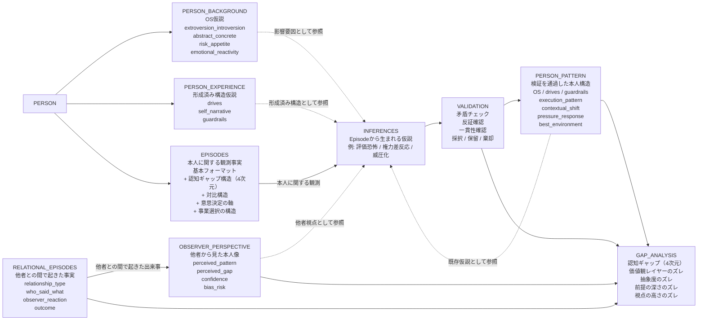
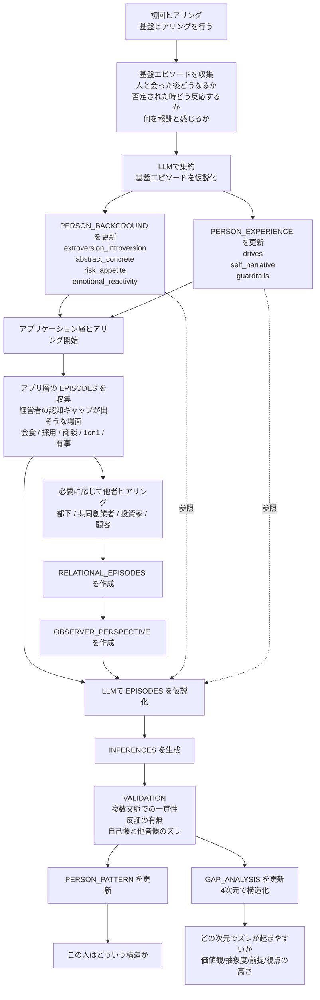
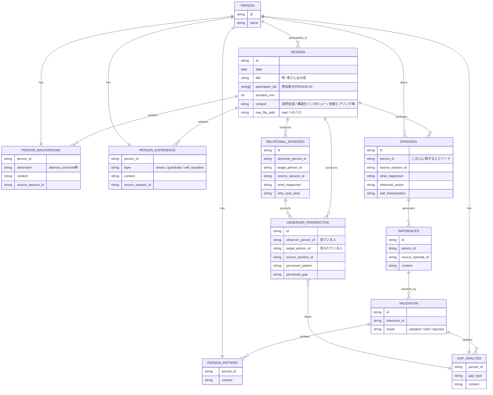

# ER Diagram / Blueprint

このファイルでは、Benten の schema を2つの観点で示す。

- エンティティがどう繋がるか
- 実際にどう作られていくか

---

## 1. Entity Relation

---

## 2. Blueprint

このモデルは、最初から `Person_Pattern` を決めるのではない。  
まず基盤ヒアリングを行い、LLM で `Background` と `Experience` の仮説を集約し、その後アプリケーション文脈の Episode を蓄積していく。

---

## 3. 実際のイメージ

### フェーズ1

- 本人への基盤ヒアリングを行う
- 具体的なエピソードを集める
- LLM で `Person_Background` と `Person_Experience` の仮説に整理する

### フェーズ2

- アプリケーション文脈で Episode を継続収集する
- 経営者なら、率直さ、委任、閉じる時間、会食後の消耗などが出る場面を取る

### フェーズ3

- 他者ヒアリングで `Relational_Episodes` と `Observer_Perspective` を作る
- 本人の意図と、相手の受け取りのズレを残す

### フェーズ4

- LLM が `Inferences` を生成する
- `Validation` で採択 / 保留 / 棄却する
- `Person_Pattern` と `Gap_Analysis` を更新する

---

## 4. SESSION によるプロヴェナンス追跡（案）

更新内容ごとに「誰が喋ったか」を持つとノイズが入る。
代わりに「どの会話セッションに由来するか」だけを追跡する。
SESSION を見れば参加者は分かるので、必要な時に原文まで辿れる。

### 変更点

| 変更 | 内容 |
|------|------|
| **追加** | `SESSION` エンティティ。会話1回が1レコード。参加者・日時・文脈を持つ |
| **追加** | 各エンティティに `source_session_id`。更新内容がどの会話に由来するかを追跡 |
| **不要** | 個別データポイントごとの「話者」カラム。誰がいたかは SESSION の `participant_ids` で引ける |

### ER（SESSION 追加版）

### ポイント

- 「誰が喋ったか」ではなく「どの会話から来たか」だけを持つ。SESSION を見れば参加者は分かる
- 同一人物に対する OBSERVER_PERSPECTIVE が複数 SESSION から蓄積される場合、`source_session_id` で時系列を追える
- `raw_file_path` を SESSION が持つので、詳細を掘りたい時は原文に戻れる

---

## 一言でいうと

> 最初のヒアリングで `Background` と `Experience` の仮説を作り、  
> その後アプリケーション文脈の Episode と他者視点を足しながら、  
> `Person_Pattern` と `Gap_Analysis` を更新していくのがこの blueprint である。  
> 全ての更新は `SESSION` を経由し、由来する会話まで追跡可能にする。
